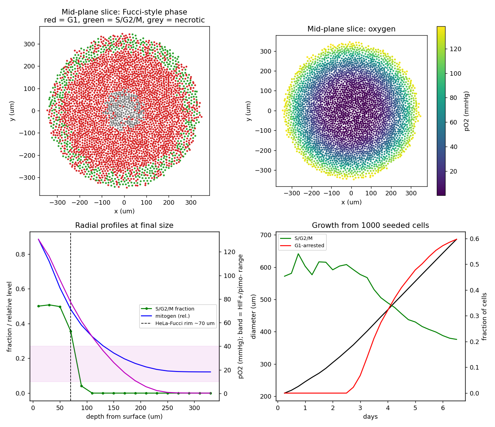

# TME world — v0: the base cell

A graph-based 3D+time tumor model. **Nodes are cells; edges join cells that touch.**
Chemical fields live on the nodes and move along edges. v0 has one cell identity (HeLa),
grown as a spheroid and checked against HeLa-Fucci spheroid data.

## Why HeLa
- The best-documented cell-cycle timings of any human line (Puck & Steffen 1963; live biosensors, Hahn et al. 2009).
- Measured volume and O2 uptake.
- A direct 3D benchmark: HeLa-Fucci spheroids (Onozato et al. 2017, *Cancer Sci*, doi:10.1111/cas.13178). At ~700 µm,
  S/G2/M cells sit in a **~70 µm outer rim**. The interior is G1-arrested and only **mildly hypoxic**
  (HIF-1α positive, pimonidazole negative).

## What one cell is (the whole state)
| field | meaning |
|---|---|
| `pos` (x,y,z) | center, µm |
| `vol` | volume; grows linearly from V_birth to 2·V_birth over the cycle |
| `age`, `T` | hours into the cycle / this cell's cycle length (lognormal) |
| `state` | alive / necrotic |
| `ctype` | identity (0 = HeLa; T cell, monocyte, fibroblast... later) |

Rules per 0.25 h step:
1. Rebuild the contact graph, then solve every field to quasi-steady state on the graph.
   Diffusion takes seconds to minutes, while the cell cycle takes hours.
2. **Nutrients:** O2 and glucose uptake follow Michaelis–Menten kinetics. Lactate is secreted at a fixed ratio to glucose uptake.
   A serum mitogen is consumed first-order.
3. **G1 checkpoint:** a G1 cell arrests if pO2 < 5 mmHg or mitogen < 0.5. S/G2/M cells finish their cycle.
4. **Division** when `age ≥ T`: two daughters, half the volume each, new lognormal `T`.
5. **Necrosis** below 0.8 mmHg O2 (hazard, mean 6 h).
6. Overlap relaxation pushes cells apart and gives weak adhesion.

Every birth, division, necrosis (and later immune entry and metastatic exit) goes to `World.events`.
Snapshots every 12 h make up the 4D record.

## Field solver (graph "flow fields")
- Edge conductance is `D·κ_ij/d_ij²` with `κ_ij = 12/(z_i+z_j)`. Summed over neighbors, this approximates `D∇²c`.
- Cells touching the medium are found by flood-filling empty space on a voxel grid, so it works for any shape.
  They exchange with the bath through one face.
- Each cell's uptake is spread over the space it occupies, computed from its contact distances at random close packing.
- Solved with Jacobi-preconditioned conjugate gradient, warm-started from the previous step.
  This takes ~0.4 s per step at 20k cells.
- **Validation** (`validate_diffusion.py`) against the analytic O2 profile in a uniformly consuming sphere:
  the interior error is ~9–12% of the total drop. The bias is systematic: the graph slightly over-depletes,
  by ~15% at 30k cells.

## Evidence for each parameter
See `out/param_table.md`. Each value is tagged **measured / derived / proxy / calibrated / assumption / numerical**.
Gaps flagged so far:
- **Cycle-time CV**: no HeLa-specific value verified. This is the first candidate to fit from FUCCI lineage data.
- **Glucose uptake and lactate:glucose ratio**: these are *HEK293* values (Noguchi et al. 2020). A search result had
  attributed them to HeLa, which was wrong. HeLa flux data are needed.
- **What drives interior quiescence**: O2 alone can't produce a 70 µm rim. With the measured HeLa O2 uptake,
  pO2 at 70 µm depth is still ~90 mmHg. So arrest is attributed to a consumed mitogen, supported by EGF-withdrawal
  quiescence (Laurent et al. 2013). Its uptake rate is **calibrated** to the rim. It could also be contact/mechanical
  inhibition (Montel 2011; Delarue 2014). This is the best place for a small learned rule once spatial data are in.
- Necrosis timing, hypoxic-arrest threshold (PhysiCell convention), glucose Km: all assumptions.

## Results: 700 µm spheroid vs. HeLa-Fucci data
Grown from 1,000 seeded cells: 160 h, 102k cells, 205k logged events, 9 min wall time on a laptop.


| readout | model | HeLa-Fucci spheroid (Onozato 2017) | verdict |
|---|---|---|---|
| S/G2/M rim thickness | drops to half its surface level between 70 and 90 µm deep | ~70 µm | ✅ matches (calibrated) |
| interior cell-cycle state | G1-arrested | G1 (Fucci red) | ✅ |
| core pO2 | **~0.3 mmHg**, plus a small necrotic core (1.7% of cells) | mildly hypoxic (HIF-1α+, pimonidazole−) ≈ 10–40 mmHg, no necrosis reported | ❌ **too hypoxic** |

**Why the core is too hypoxic.** Arrested G1 cells stay small: the mean cell volume is 1,977 µm³ against the
measured 2,425 µm³. As a result, the spheroid packs ~40% more O2 consumers per volume than the hand estimate,
which assumed full-size cells and gave a core of ~15 mmHg. Possible fixes, each needing evidence before adoption:
1. Quiescent cells consume less O2. This is commonly reported in spheroids but not yet sourced here.
2. Arrested cells keep growing to their normal size.
3. The graph solver's ~15% over-depletion contributes a smaller share.

## Run
```bash
pip install -r requirements.txt
python validate_diffusion.py   # graph diffusion vs analytic (~1 min)
python run_spheroid.py 700     # grow to 700 um (writes out/)
python analyze.py              # compare to HeLa-Fucci spheroid
```

## T cells (v0: naive and effector CD8 T cells)
T cells are motile agents (`tme/tcells.py`) that **enter** at the tumor margin, take a persistent random walk with
tumor cells as obstacles, and **exit** if they wander more than 200 µm beyond the tumor edge. Every entry, exit, hit,
kill and anergy event is logged. Parameters are in `params.TCELL`, with sources.

| State | Behavior | Evidence |
|---|---|---|
| **Naive** | 8 µm; 10.3 µm/min, median turn 47.5°. No killing machinery. Cognate contact gives signal 1 only. | Mrass 2006; Kaech & Cui 2012 |
| **Anergic** | Naive cell given signal 1 without CD28 costimulation for 8 h cumulative. Hyporesponsive. | Chen & Flies 2013; Schwartz 2003 (8 h threshold = assumption) |
| **Effector CTL** | Blast (~3× volume), 8 µm/min in tumor. Arrests on cognate tumor cells for ~15 min (median) contacts. Each contact = one perforin/granzyme **hit**. | Boissonnas 2007; Weigelin 2021 |

**Killing is multi-hit.** About 5% of single contacts kill. Otherwise sublethal damage accumulates and decays with a
49 min median recovery; ~3 hits within that window kill. The target becomes **apoptotic** (rounding within 2 min,
Lopez 2013) and is cleared 6 h later (assumption: no phagocytes yet). Only effector CTLs kill.

**Who recognizes HeLa:**
- In a naive polyclonal repertoire, ~7% of T cells react to HeLa. HeLa is allogeneic to any donor, and ~7% is
  the alloreactive precursor frequency (Suchin 2001, mouse; a proxy).
- HeLa is reported to lack CD80/CD86 (low-confidence source). So naive T cells cannot be primed by HeLa alone.
  Priming waits for dendritic cells and macrophages.

```bash
python run_spheroid.py --tcells naive    --t-end 120 --snap-every 6 --out out/naive
python run_spheroid.py --tcells effector --t-end 120 --snap-every 6 --out out/effector   # e.g. adoptive transfer
python export_viewer.py out/effector     # then open http://localhost:8765/?run=effector
```

**Results: 1,000 seeded cells, T cells arriving at 10/h from 72 h to 120 h**

| Run | T cells entered | Exited | Anergic | Hits | Kills | Kills per CTL-day |
|---|---|---|---|---|---|---|
| Naive | 451 (27 cognate) | 406 | 0 | 0 | 0 | — |
| Effector | 474 | 314 | — | 8,783 | 841 | ~2 |

- **Naive:** T cells wander past the tumor and leave without engaging it. That is immunological ignorance, which is
  expected with no APCs and no chemokine guidance (TILs show no long-range chemotaxis, Mrass 2006). Too few cognate
  cells stay in contact for 8 h to become anergic.
- **Effector:** the killing rate emerges from the hit rules and falls inside the measured in vivo range of 2–16 kills
  per CTL per day (Halle 2016). The tumor still grows because proliferation outpaces killing at this CTL dose.
- **Not yet modeled:** T cells don't push tumor cells, consume nutrients, divide, or follow chemokines. Effector
  exhaustion, IFN-γ and PD-L1 are next.

## 4D viewer (three.js)
```bash
python export_viewer.py                          # out/snapshots.npz -> viewer/data/frames.bin.gz
python -m http.server 8765 --directory viewer    # then open http://localhost:8765
```
- Play/scrub through time. Cells are matched by id and interpolated between 12 h snapshots. The speed slider is
  log-scale, from 3 min/s (slow enough to watch mitosis) to 48 h/s.
- **Mitosis** at the true division time from the event log, using HeLa sub-stage timings (Chakraborty et al. 2008):
  - the mother turns **yellow** 65 min before cytokinesis (nuclear envelope breakdown);
  - in the last 10 min (anaphase → cytokinesis) the daughter emerges from the mother and the two lobes separate, both yellow;
  - both become G1 (red) once cytokinesis completes.
- **Division shape**: from anaphase to cytokinesis the dividing cell is drawn as one mesh that elongates along the
  division axis and pinches a cleavage furrow, then becomes two daughters. The shape comes from the vertex shader,
  and a finer mesh is used for cells mid-division.
- **Rendering**:
  - *Cells (spheres)*, with an optional subtle membrane wobble.
  - *Smooth tissue (blob)*: a screen-space surface (the technique used for particle fluids). Cell color and depth
    are drawn to a texture, blurred with a depth-aware filter, and lit as one continuous surface. The **Smoothing**
    slider sets the blur radius in µm. This is visual only, not physics. Interior cells aren't visible in this mode,
    so opacity fades the surface.
  - Measured per-frame cost at 102k cells: ~19 ms (state update + upload + draw); smooth mode adds its blur passes.
- **T cells**: white spheres with a big **T** that always faces the camera. The letter shows state: black =
  naive, gray = anergic, red = effector CTL.
  - New T cells **fly in from the +x side** to where they entered, and leaving T cells fly back out. These
    animations run in wall-clock time (~1.4 s), so they are visible at any playback speed.
  - Each CTL hit shows a burst of **magenta perforin/granzyme granules** traveling to the target (~1 s). Killed cells
    turn **purple** (apoptotic) and shrink until cleared.
  - Click a T cell for its state, whether it recognizes HeLa, and its hits and kills so far.
  - Pick a run with `?run=<name>`.
- **Lineage**: color by founding clone, or click any cell to see its ancestry (seeded founder → … → cell, with
  birth times) and the live size of its clone. "Highlight clone" isolates that clone in 3D.
- **Cell opacity** slider: lower it to see the interior through the outer cells.
- Color by cell-cycle phase (Fucci-style) or by pO2.
- **Cross-section** inset (top right): transverse / coronal / sagittal, with a slider through the spheroid.
  The plane is shown in the 3D view, and each cell is drawn as its true circle of intersection.
- **Record video**: plays from the start and saves the 3D view, the inset and a time label as WebM (MP4 on Safari).

## Indications, fibroblasts and immune cells
Four tumor types beyond the HeLa baseline, each with a reference cell line, doubling time, driver set and
per-division mutation rate ([`docs/indications.md`](docs/indications.md)); fibroblasts that deposit ECM
([`docs/fibroblasts.md`](docs/fibroblasts.md)); and a procedurally generated immune compartment
([`docs/immune_cells.md`](docs/immune_cells.md)).

```bash
python run_spheroid.py --indication PDAC --fibroblasts --immune 400 --out out/pdac
python export_viewer.py out/pdac      # then open http://localhost:8765/?run=pdac
python validate_mutations.py          # mutation model vs Werner 2020
python validate_ecm.py                # ECM storage, calibration, T-cell exclusion
python validate_immune.py             # composition, spatial rules, priming, suppression
```

| | PDAC | LUAD | OV (HGSOC) | BRCA |
|---|---|---|---|---|
| Reference line | PANC-1 | A549 | Kuramochi | MCF-7 |
| Doubling time | 29 h | 27 h | 46 h | 35 h |
| Mutations/division | ~11 | ~46 | ~17 | ~9 |
| Immune phenotype | excluded | inflamed | moderate | variable |
| CD8 per 100 tumor cells | 1.0 | 7.5 | 3.0 | 4.0 |
| ECM at tumor edge (7 d) | 0.72 | 0.14 | 0.28 | 0.28 |

**Mutations are acquired at division**, as a Poisson draw with rate `1.14 x tumor_factor` (Werner et al. 2020:
healthy tissue is 1.14 mutations/division, tumors 4-100x that). Each mutation may hit a driver gene, drawn from
indication-specific weights. Driver fitness effects are deliberately near-neutral (Williams et al. 2016).

**Of the 119 model parameters, 61 are assumptions** - `out/param_table.md` lists every one with its evidence
status and source. That ratio is the honest state of the model, and the assumption-tagged rows are the backlog.

## Parked ideas
- **Two-agent system (body vs. tumor)**: revisit once immune/stromal cell types exist.
- **Resumable, compressed states**: an entity–component format with per-component precision, plus keyframes and deltas.

## Files
- `tme/params.py` — every parameter with its source
- `tme/world.py` — the world: cells, contact graph, fields, cycle, events
- `validate_diffusion.py` — graph-diffusion vs. analytic check
- `run_spheroid.py` — grow to 700 µm; writes `out/snapshots.npz`, `out/events.csv`, `out/log.csv`
- `analyze.py` — comparison with the HeLa-Fucci spheroid; writes `out/spheroid_summary.png`
